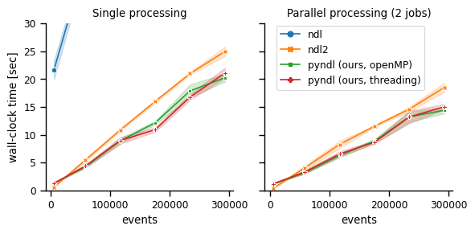

Benchmark
=========

Here we compare the performance of Naive Discrimination Learning in `pyndl`
with other implementations, namely from the `R` packages `ndl` and `ndl2`. 

This document summarizes the benchmarking procedure and results; the code to run
these is available in the repository's `benchmark folder <https://github.com/quantling/pyndl/tree/main/benchmark>`_.  

Creating the event files
------------------------

The benchmark datasets are trigram-to-word events on the text of the 
German *Graphem* Wikipedia page, that can be generated with ``python preprocessing.py``.

::
    
    Cues: ['aph', 'em#', 'hem', 'gra', 'rap', '#gr', 'phe'], Outcome: ['graphem']
    Cues: ['aus', '#au', 'us#'], Outcome: ['aus']
    Cues: ['wik', '#wi', 'kip', 'iki', 'edi', 'ia#', 'ped', 'ipe', 'dia'], Outcome: ['wikipedia']
    …
    Cues: ['ქარ', '#ქა', 'ართ', 'ლი#', 'რთუ', 'თულ', 'ული'], Outcome: ['ქართული']
    Cues: ['ша#', 'қша', 'ақш', '#қа', 'зақ', 'қаз', 'аза'], Outcome: ['қазақша']
    Cues: ['#한국', '한국어', '국어#'], Outcome: ['한국어']
    …

The text contains some non-ASCII characters from various languages. 
While this is not a problem with `pyndl`, these characters would crash `ndl2`.
This is why create cue-outcome events with a basic preprocessing, 
including just ASCII characters and letters.
Please note, that in research applications we recommend using dedicated software for more careful
preprocessing.

.. code-block:: python
    
    preprocess.create_event_file(corpus_file=txt_file,
                                 event_file=ascii_event_file,
                                 allowed_symbols='a-zA-Z0-9',
                                 context_structure='document',
                                 event_structure='consecutive_words',
                                 event_options=(1,),  # number of words,
                                 cue_structure="trigrams_to_word",
                                 lower_case=True,
                                 remove_duplicates=True)

Based on this event file, 
we construct large scale event file by concatenating all events multiple times.

.. code-block:: python

    ascii_events = list(io.events_from_file(ascii_event_file))
    io.events_to_file(ascii_events * times, event_dir / f"{times}_times_{ascii_event_file.name}", compatible=True)
    
    
Running pyndl
-------------

Our benchmark compares the runtime of `pyndl`'s NDL implementations on event files of varying size. 
The naive `dict_ndl` learner is orders of magnitude slower and thus excluded from the comparison.
In addition to single processing,  both parallel processing methods
(*threading* and *OpenMP*) are included. Run the benchmark with ``python run_ndl.py``, which
saves the wall-clock times in a CSV files.

.. code-block:: python

    def clock(func, args, **kwargs):
        gc.collect()
        start = time.time()
        result = func(*args, **kwargs)
        stop = time.time()
        duration = stop - start
        return result, duration
    …
    for r in range(repeats):
        for file_path in event_dir.glob('*.tab.gz'):
            _, duration_omp1 = clock(ndl.ndl, (file_path, ALPHA, BETAS, LAMBDA_), n_jobs=1, method='openmp') 
            _, duration_omp4 = clock(ndl.ndl, (file_path, ALPHA, BETAS, LAMBDA_), n_jobs=4, method='openmp') 
            …

Running R `ndl` and `ndl2`
--------------------------

The `R <https://www.r-project.org/>`_ benchmark includes the equilibrium learner of `ndl` and
the iterative learner of `ndl2`. ``R -f run_ndl.R`` runs the `ndl2` on the same event files as `pyndl`,
while `ndl` only runs on the smaller files because it is orders of magnitude slower.

`ndl` can be installed from CRAN by running ``install.packages('ndl')`` in R,
while `ndl2` needs to be downloaded from Github first (`ndl2
<https://github.com/quantling/ndl2>`_, install with ``R CMD INSTALL ndl2.tar.gz``).

Both `ndl` and `ndl2` cannot handle compressed event files right away. For `ndl`, we 
load the full event file into memory (included in time measurement), while `ndl2` reads an uncompressed event
files.

.. code-block:: R

    …
    for (r in 1:10) {
        file_path <- event_files[i]
	    for (i in 1:n) {
		    st_proc_time <- system.time({
	        	    learner <- learnWeightsTabular(gsub("[.]gz$", "", file_path), alpha=0.1, beta=0.1, lambda=1.0, numThreads=1, useExistingFiles=FALSE)
		    })
	        mt_proc_time <- system.time({
	        	    learner <- learnWeightsTabular(gsub("[.]gz$", "", file_path), alpha=0.1, beta=0.1, lambda=1.0, numThreads=4, useExistingFiles=FALSE)
		    })
            …
	
		    if (nrow(event_df) < 100000) {
		    proc_time <- system.time({
		        event_df <- read.delim(gzfile(file_path))
		        output <- estimateWeights(cuesOutcomes=event_df) 
		    }, gcFirst = TRUE)
		    } 
		    …
	    }   
	    …
    }

Results and discussion
----------------------

We visualize the wall-clock time for the various NDL implementations and number of events as a line 
plot with error bars for the standard-error within the ten repetitions (``python plot_result.py``, requires the plotting packages `seaborn`).
The shown wall-clock times were recorded on a laptop (*Intel(R) Core(TM) i7-8565U CPU* running *Ubuntu 20.4*, *R 3.6* and *python 3.9*).

    
For small event files the `pyndl` are less than one second slower than `ndl2` but still almost twenty times faster than `ndl`. With increasing number of events, `pyndl` becomes the fastest method
in both single and parallel processing (2 jobs). 

`pyndl` processes the event file into a faster accessible format, which results
in the overhead for event files. This is similarly done in `ndl2` where this
overhead for small event files seems to be less time consuming. However, in
contrast to the implementations in `ndl2` and `ndl`, the implementation in
`pyndl` never reads the full event file into memory, which is faster and has a
smaller memory footprint than its competitors.

